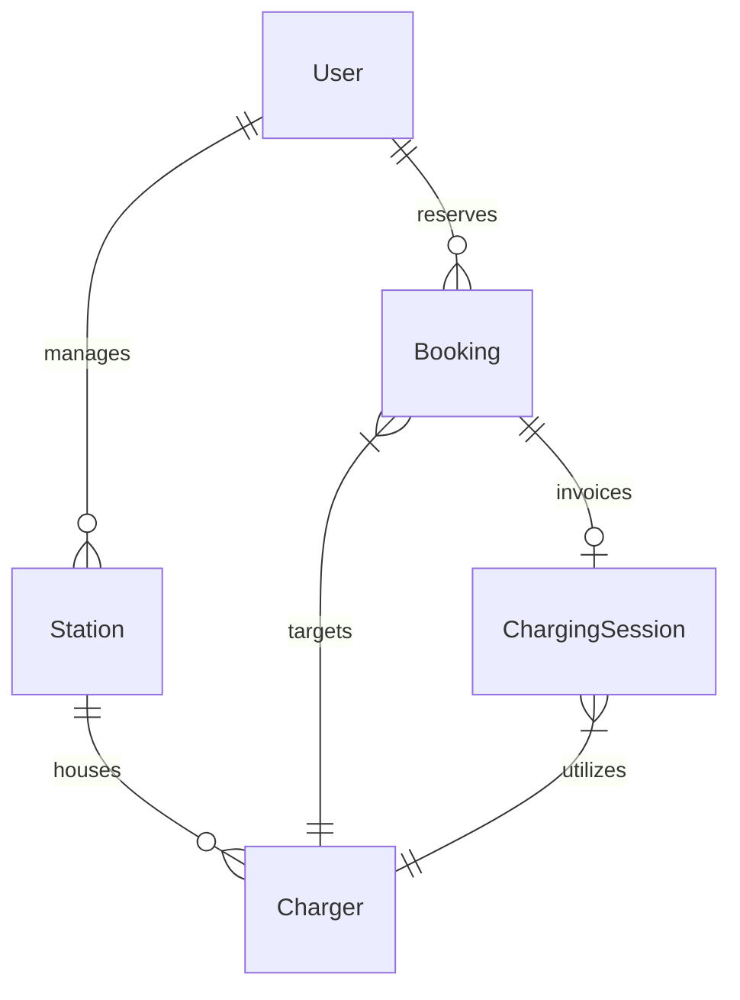

<!-- @format -->

# ⚡ Evolts Backend Engine

[](https://evolts-jk0p.onrender.com)
**Live API Deployment:** [https://evolts-jk0p.onrender.com](https://evolts-jk0p.onrender.com)

An enterprise-grade, high-performance RESTful API powering **Evolts**—a smart Electric Vehicle (EV) Charging Station Locator and Reservation platform.

This engine is built on **Node.js, Express, and MongoDB**, utilizing **Mongoose** for modeling, **Zod** for schema validation, and **JSON Web Tokens (JWT)** for role-based security.

---

## 📖 Table of Contents

- [🛠️ Technology Stack](#%EF%B8%8F-technology-stack)
- [🎯 Core Features Showcase](#-core-features-showcase)
- [🏗️ Architectural Blueprint](#%EF%B8%8F-architectural-blueprint)
- [🗃️ Database Schema & Relational Design](#%EF%B8%8F-database-schema--relational-design)
- [🚀 Advanced System Design & Optimizations](#-advanced-system-design--optimizations)
  - [1. Geospatial Proximity Aggregation](#1-geospatial-proximity-aggregation)
  - [2. Concurrency & Race-Condition Mitigation](#2-concurrency--race-condition-mitigation)
  - [3. Timezone-Safe Slot Scheduling](#3-timezone-safe-slot-scheduling)
  - [4. Database Optimization via Facet Pagination](#4-database-optimization-via-facet-pagination)
  - [5. Granular Role-Based Access Control (RBAC)](#5-granular-role-based-access-control-rbac)
  - [6. Dynamic Slot Generation Algorithm](#6-dynamic-slot-generation-algorithm)
  - [7. Strict Booking State Machine](#7-strict-booking-state-machine)
- [🔌 API Playbook](#-api-playbook)
- [⚙️ Setup & Local Development](#%EF%B8%8F-setup--local-development)

---

## 🛠️ Technology Stack

The backend engine is engineered using modern, robust, and secure technologies:

- **Runtime & Framework**:   (Express.js v5)
- **Database**:   (Mongoose ODM)
- **Validation**:  (Zod Schemas)
- **Security & Protection**:  (JSON Web Tokens), `bcrypt` (Hashing), and  (HTTP headers security)
- **Traffic Management**: `express-rate-limit` (DDoS mitigation) and `cors` (Cross-Origin Resource Sharing)

---

## 🎯 Core Features Showcase

The Evolts Backend Engine is built to deliver a seamless, secure, and reliable EV charging reservation experience. Here are the core features implemented in the system:

- **Secure Authentication & RBAC**: Dual-layered protection using password encryption (Bcrypt) and JWT-based authentication. The API enforces strict **Role-Based Access Control** for Drivers, Station Owners, and Administrators.
- **Geospatial Proximity Search**: Utilizes MongoDB `2dsphere` indexing and spatial aggregation queries to locate nearby charging hubs within a dynamic radius of coordinates.
- **Pre-Booked Hourly Reservations**: Enforces a strict 1-hour reservation window for individual chargers, preventing overlaps and conflicts at the database level.
- **OTP Check-In Verification**: Bridges physical arrival at a charging station with digital activation by generating and verifying a 6-digit OTP code through the station owner portal.
- **Automated Charging Session Tracker**: Automatically computes elapsed charging duration, energy consumed (in kWh) based on hardware capacity, and outputs detailed billing records upon ending a session.
- **Robust Schema Validation**: Rejects malformed requests at the gateway router level using structured Zod schemas to ensure database integrity.

---

## 🏗️ Architectural Blueprint

To achieve separation of concerns, high testability, and modularity, the API uses the **Layered Service-Repository Pattern**.

```
[Client Request]
      │
      ▼
[Express Router] ──────► Runs JWT Auths & Role Checks (RBAC)
      │
      ▼
[Validation Layer] ────► Sanitizes & coerces payloads via Zod Schemas
      │
      ▼
[Controller Layer] ────► Extracts requests & delegates to Services
      │
      ▼
[Service Layer] ───────► Executes Core Business Logic, Math, & Constraints
      │
      ▼
[Repository Layer] ────► Abstracts DB interactions & Aggregation queries
      │
      ▼
[MongoDB Mongoose]
```

### Design Decisions

- **Service-Repository Separation**: Controllers are thin entry points. Services hold pure business rules. Repositories handle database drivers. This prevents DB changes from breaking business logic.
- **Zod Gatekeeper**: Invalid payloads are rejected at the routing layer before triggering database operations, reducing overhead and improving security.

---

## 🗄️ Database Schema & Relational Design

Evolts utilizes a relational document model in MongoDB to track users, charging hubs, hardware specifications, reservations, and active invoices.



### Model Schemas

  <details>
  <summary>📂 1. User Schema (Click to expand)</summary>

- **Path:** [user.model.js](file:///c:/my-projects/Evolts/backend/src/module/users/user.model.js)
- **Key Fields**:
  - `username` / `phoneNumber` / `email` (Unique, Lowercase).
  - `role`: Enum `["user", "station_owner", "admin"]`. Defaults to `"user"`.
  - `vehicles`: Embedded subdocument array tracking registration plates and vehicle class (e.g. `2wheeler`, `4wheeler`).
  </details>

  <details>
  <summary>📂 2. Station Schema (Click to expand)</summary>

- **Path:** [station.model.js](file:///c:/my-projects/Evolts/backend/src/module/stations/station.model.js)
- **Key Fields**:
  - `ownerId`: ObjectId referencing the owner User.
  - `name`: Lowercased string with text index for full-text search.
  - `location`: GeoJSON Point containing `[longitude, latitude]`.
  - `openTime` / `closeTime`: Operational hours constraints (Format: `HH:mm`).
- **Indexes**: Indexed with a `2dsphere` index for coordinate queries.
  </details>

    <details>
    <summary>📂 3. Charger Schema (Click to expand)</summary>

- **Path:** [chargers.model.js](file:///c:/my-projects/Evolts/backend/src/module/chargers/chargers.model.js)
- **Key Fields**:
  - `stationId`: ObjectId referencing the host Station.
  - `chargerNo`: Unique string identifier per station.
  - `connectorType`: Enum `["CCS", "CHAdeMO", "NACS", "Type2"]`.
  - `powerKw`: Hardware capacity (e.g. 50kW, 150kW).
  - `pricingPerKwh`: Target billing rate.
- **Indexes**: Compound unique index on `{ stationId: 1, chargerNo: 1 }` to guarantee unique charger codes per hub.
  </details>

    <details>
    <summary>📂 4. Booking Schema (Click to expand)</summary>

- **Path:** [booking.model.js](file:///c:/my-projects/Evolts/backend/src/module/bookings/booking.model.js)
- **Key Fields**:
  - `userId` / `stationId` / `chargerId` relations.
  - `startTime` / `endTime` ISO UTC Date objects.
  - `status`: Lifecycle states (`"booked"`, `"arrived"`, `"charging"`, `"completed"`, `"cancelled"`).
  - `otp`: 6-digit random check-in code.
  - `isVerified`: Boolean OTP confirmation flag.
- **Indexes**: Compound unique index on `{ chargerId: 1, startTime: 1 }` to prevent database-level double-bookings.
  </details>

    <details>
    <summary>📂 5. Charging Session Schema (Click to expand)</summary>

- **Path:** [chargingSession.model.js](file:///c:/my-projects/Evolts/backend/src/module/chargingSession/chargingSession.model.js)
- **Key Fields**:
  - `bookingId`: Unique ObjectId referencing the Booking.
  - `chargerId` relation.
  - `startedAt` / `endedAt` timestamps.
  - `energyConsumedKwh` / `pricePerKwh` / `total` invoice cost.
  </details>

---

## 🚀 Advanced System Design & Optimizations

### 1. Geospatial Proximity Aggregation

Locating nearby stations requires fast geospatial computation. The backend leverages MongoDB's native **Aggregation Pipelines**:

```javascript
pipeline.push({
  $geoNear: {
    near: { type: "Point", coordinates: [lng, lat] },
    maxDistance: radius,
    distanceField: "distanceInMeters",
    spherical: true,
  },
});
```

- **The Optimization:** Distance is calculated in meters, converted to kilometers, and rounded using `$addFields`. The pipeline then uses `$facet` to return paginated results and total matched item counts in a single round-trip database operation, drastically reducing database load.

### 2. Concurrency & Race-Condition Mitigation

In-memory validations are vulnerable to race conditions under load. If two concurrent requests try to reserve the exact same charger slot at the same millisecond, both will pass code checks and write duplicates.

- **The Fix:** We implemented a compound unique index on `{ chargerId: 1, startTime: 1 }` directly on the database. Concurrent duplicate writes are rejected at the engine level, guaranteeing slot reservation integrity.

### 3. Timezone-Safe Slot Scheduling

- **UTC Conversions**: Bookings are stored as UTC Date formats. However, checking slot overlaps requires offset matching. The backend appends Indian Standard Time (IST, `+05:30`) to raw parameters before parsing, keeping database records timezone-safe.
- **Slot Validation**: Start times are checked to ensure they are not in the past and fit within the station's operational hours (`openTime`/`closeTime`). The slot duration is validated to be exactly 1 hour.

### 4. Database Optimization via Facet Pagination

Pagination typically requires two separate database operations: one query to fetch the current page of records, and another to count the total matching documents for page numbers.

- **The Optimization:** In both `findAllStations` and `getAllBookings` repositories, the engine uses MongoDB `$facet` aggregation pipelines. This allows the database to execute the pagination (`$skip` and `$limit`) and the overall document count in parallel inside a single database round-trip, reducing query overhead by 50%.

### 5. Granular Role-Based Access Control (RBAC)
 
Secure API designs must separate user privileges cleanly to prevent unauthorized operations (vertical authorization bypasses).
 
- **The Implementation:** Enforces route privileges across three distinct roles (`user`, `station_owner`, `admin`) utilizing a declarative Express middleware pipeline. Tokens are verified and user claims are matched against endpoint policies before requests are allowed to reach service layers.
 
### 6. Dynamic Slot Generation Algorithm
 
Computing charger slot availability on the fly requires programmatic interval matching to avoid static timeline limitations.
 
- **The Implementation:** Resolves the operational opening and closing hours of the station, pulls all active bookings for the selected date, and walks through the day in 1-hour intervals. It computes availability dynamically using interval overlap verification, returning an active status timeline to the user.
 
### 7. Strict Booking State Machine
 
To prevent API requests from bypassing the physical check-in flow, the booking lifecycle is managed through a strict state machine:
 
- **Manual updates** (via the `PATCH /booking/:id` gateway) are restricted to `"arrived"` or `"cancelled"`.
- **System updates** (such as `"charging"` or `"completed"`) are only triggered as side effects of session-start and session-end events, ensuring an active charging session matches the database booking status.

---

## 🔌 API Playbook

Below is the structured API registry.

| Category | Endpoint | Method | Auth | Description |
| :--- | :--- | :---: | :---: | :--- |
| **Auth** | `/auth/register` | `POST` | Public | Register a new user, owner, or admin |
| **Auth** | `/auth/login` | `POST` | Public | Authenticate credentials and get JWT token |
| **Station** | `/station` | `POST` | Owner/Admin | Create a new charging hub |
| **Station** | `/station` | `GET` | User | Get and filter stations (includes geolocation search) |
| **Station** | `/station/:stationId` | `GET` | User | Get detailed station data (includes chargers) |
| **Station** | `/station/:stationId` | `PUT` | Owner/Admin | Update station metadata |
| **Station** | `/station/:stationId` | `DELETE` | Admin | Delete station (cascading cleanup) |
| **Charger** | `/charger` | `POST` | Owner/Admin | Register a charger plug under a station |
| **Charger** | `/charger/:chargerId` | `GET` | User | Get single charger details |
| **Charger** | `/charger/station/:stationId`| `GET` | User | Fetch and filter chargers at a station |
| **Charger** | `/charger/:chargerId` | `PATCH` | Owner/Admin | Update charger status (available/maintenance) |
| **Charger** | `/charger/:chargerId` | `PUT` | Owner/Admin | Update charger details |
| **Charger** | `/charger/:chargerId` | `DELETE` | Owner/Admin | Delete charger from station |
| **Charger** | `/charger/:chargerId/get-slots`| `POST` | User | Fetch slot availability for a date |
| **Charger** | `/charger/:chargerId/station/:stationId`| `GET` | User | Fetch specific charger in a station |
| **Booking** | `/booking` | `POST` | User | Book a 1-hour charger slot |
| **Booking** | `/booking` | `GET` | User/Admin | Search and filter bookings |
| **Booking** | `/booking/:bookingId` | `GET` | User/Admin | Retrieve specific booking details |
| **Booking** | `/booking/:bookingId` | `PATCH` | User/Admin | Check in (`arrived`) or cancel (`cancelled`) |
| **Booking** | `/booking/:bookingId/verify-otp`| `POST` | Owner/Admin | Verify check-in OTP code |
| **Session** | `/chargerSession/:bookingId/start-session` | `POST` | User | Start charging (requires OTP verified status) |
| **Session** | `/chargerSession/:bookingId/end-session` | `POST` | User | End charging and calculate billing |
| **Session** | `/chargerSession/:sessionId` | `GET` | User | Get specific charging session details |

---

### 📂 Detailed Swagger-Style API Reference

Each route details its parameters, request payload constraints, and HTTP response codes.

#### 1. Authentication Endpoints (`/auth`)

<details>
<summary><b>POST /auth/register</b> - Register User</summary>

*   **Description**: Registers a new User, Station Owner, or Administrator account.
*   **Security**: None (Public)
*   **Request Body (application/json)**:
    | Field | Type | Required | Constraints | Description |
    | :--- | :---: | :---: | :--- | :--- |
    | `username` | `string` | Yes | Min 3 characters, Trimmed | Full name of the user |
    | `phoneNumber`| `string` | Yes | Exact 10 digits, Trimmed | Primary contact number |
    | `email` | `string` | Yes | Valid email format, Lowercased | User's email address |
    | `password` | `string` | Yes | Min 6 characters | Plaintext password |
    | `role` | `string` | Yes | Enum: `user`, `station_owner`, `admin` | Access privilege level |
    | `vehicles` | `array` | No | - | List of vehicle objects |
    | `vehicles[].vehicleNo` | `string` | Yes | Exact 10 characters, Uppercased | Vehicle registration number |
    | `vehicles[].type` | `string` | Yes | Enum: `2wheeler`, `4wheeler` | Vehicle class type |
*   **Responses**:
    *   **201 Created**: User created successfully.
        ```json
        {
          "success": true,
          "message": "user created successfully",
          "data": {
            "user": {
              "_id": "666d92984ea0a1c6a6fcf7a1",
              "username": "Alex Carter",
              "phoneNumber": "9876543210",
              "email": "alex@evolts.com",
              "role": "user",
              "vehicles": [{ "vehicleNo": "MH12CD5678", "type": "4wheeler", "_id": "666d92984ea0a1c6a6fcf7a2" }],
              "createdAt": "2026-06-15T13:40:00.000Z",
              "updatedAt": "2026-06-15T13:40:00.000Z"
            },
            "token": "eyJhbGciOiJIUzI1NiIsInR5cCI6IkpXVCJ9..."
          }
        }
        ```
    *   **400 Bad Request**: Validation constraints violated.
        ```json
        { "success": false, "errors": { "fieldErrors": { "email": ["Please enter a valid email address"] } } }
        ```
    *   **409 Conflict**: Email is already registered.
        ```json
        { "success": false, "message": "user already exists" }
        ```
</details>

<details>
<summary><b>POST /auth/login</b> - Authenticate User</summary>

*   **Description**: Authenticates user credentials and issues a JWT token.
*   **Security**: None (Public)
*   **Request Body (application/json)**:
    | Field | Type | Required | Constraints | Description |
    | :--- | :---: | :---: | :--- | :--- |
    | `email` | `string` | Yes | Valid email format | User's registered email |
    | `password` | `string` | Yes | Min 6 characters | User's password |
*   **Responses**:
    *   **200 OK**: Login successful. Returns JWT token.
        ```json
        {
          "success": true,
          "message": "user loggedin successfully",
          "data": {
            "user": {
              "_id": "666d92984ea0a1c6a6fcf7a1",
              "username": "Alex Carter",
              "email": "alex@evolts.com",
              "role": "user",
              "vehicles": [{ "vehicleNo": "MH12CD5678", "type": "4wheeler" }]
            },
            "token": "eyJhbGciOiJIUzI1NiIsInR5cCI6IkpXVCJ9..."
          }
        }
        ```
    *   **401 Unauthorized**: Password does not match.
        ```json
        { "success": false, "message": "Password is not Matched" }
        ```
    *   **404 Not Found**: Email not registered.
        ```json
        { "success": false, "message": "User not exist with this email, plz register" }
        ```
</details>

---

#### 2. Charging Station Endpoints (`/station`)

<details>
<summary><b>POST /station</b> - Create Hub</summary>

*   **Description**: Registers a new charging hub.
*   **Security**: Bearer Token (`station_owner` or `admin`)
*   **Request Body (application/json)**:
    | Field | Type | Required | Constraints | Description |
    | :--- | :---: | :---: | :--- | :--- |
    | `ownerId` | `string` | Yes | Valid MongoID string | Associated owner User ID |
    | `name` | `string` | Yes | Min 3 characters, Trimmed | Station name |
    | `address` | `string` | Yes | Min 5 characters, Trimmed | Detailed station address |
    | `location` | `object` | Yes | GeoJSON structure | Geographic location |
    | `location.type` | `string` | Yes | Must be `"Point"` | GeoJSON coordinates type |
    | `location.coordinates`| `array` | Yes | Exactly `[lng, lat]` numbers | Location coordinates |
    | `status` | `string` | Yes | Enum: `"online"`, `"offline"` | Operational status |
    | `pricing` | `number` | Yes | Min 1 | Base charging hourly pricing |
    | `openTime` | `string` | Yes | Format: `HH:mm` (24hr clock) | Operational opening hour |
    | `closeTime` | `string` | Yes | Format: `HH:mm` (24hr clock) | Operational closing hour |
*   **Responses**:
    *   **201 Created**: Station registered successfully.
        ```json
        {
          "success": true,
          "message": "station created successfully",
          "data": {
            "_id": "666d9b324ea0a1c6a6fcf7b5",
            "ownerId": "666d92984ea0a1c6a6fcf7a1",
            "name": "evolts west hub",
            "address": "Baner Link Road, Pune",
            "location": { "type": "Point", "coordinates": [73.7915, 18.5601] },
            "status": "online",
            "pricing": 35,
            "openTime": "07:00",
            "closeTime": "23:00"
          }
        }
        ```
    *   **409 Conflict**: A station already exists at this exact coordinate.
        ```json
        { "success": false, "message": "station already Exists" }
        ```
</details>

<details>
<summary><b>GET /station</b> - Search Stations</summary>

*   **Description**: Queries stations using filters, sorting, and geospatial proximity calculations.
*   **Security**: Bearer Token (Authenticated Users)
*   **Query Parameters**:
    | Parameter | Type | Required | Defaults | Description |
    | :--- | :---: | :---: | :---: | :--- |
    | `ownerId` | `string` | No | - | Filters stations owned by owner |
    | `name` | `string` | No | - | Case-insensitive prefix filter |
    | `status` | `string` | No | - | Enum: `online`, `offline` |
    | `minPrice` / `maxPrice`| `number` | No | - | Pricing range filter |
    | `lat` / `lng` | `number` | No | - | Center coordinate for proximity search |
    | `radius` | `number` | No | `5000` | Search radius boundary in meters |
    | `page` | `number` | No | `1` | Pagination page index |
    | `limit` | `number` | No | `10` | Pagination page size |
*   **Responses**:
    *   **200 OK**: Return search matching results.
        ```json
        {
          "success": true,
          "message": "All Available Stations",
          "data": {
            "page": 1,
            "limit": 10,
            "totalItems": 1,
            "totalPages": 1,
            "stations": [{ "_id": "666d9b324ea0a1c6a6fcf7b5", "name": "evolts west hub", "distance": 0.8 }]
          }
        }
        ```
</details>

<details>
<summary><b>GET /station/:stationId</b> - Read Hub details</summary>

*   **Description**: Fetches metadata and nested active chargers for a specific station.
*   **Security**: Bearer Token (Authenticated Users)
*   **Path Parameters**:
    *   `stationId`: Valid MongoDB ObjectId.
*   **Responses**:
    *   **200 OK**: Details loaded successfully.
        ```json
        {
          "success": true,
          "message": "Station: evolts west hub",
          "data": {
            "_id": "666d9b324ea0a1c6a6fcf7b5",
            "name": "evolts west hub",
            "chargers": [{ "_id": "666da2354ea0a1c6a6fcf7c9", "chargerNo": "CH-01", "status": "available" }]
          }
        }
        ```
    *   **404 Not Found**: Station ID does not exist.
        ```json
        { "success": false, "message": "Station Not Found" }
        ```
</details>

<details>
<summary><b>PUT /station/:stationId</b> - Update Hub</summary>

*   **Description**: Performs a partial metadata update on a station.
*   **Security**: Bearer Token (`station_owner` or `admin`)
*   **Path Parameters**:
    *   `stationId`: Valid MongoDB ObjectId.
*   **Request Body (application/json)**: Partial matching schema of creation payload (at least 1 key required).
*   **Responses**:
    *   **200 OK**: Station updated.
        ```json
        {
          "success": true,
          "message": "Station Updated Successfully",
          "data": { "_id": "666d9b324ea0a1c6a6fcf7b5", "status": "offline" }
        }
        ```
</details>

<details>
<summary><b>DELETE /station/:stationId</b> - Delete Hub</summary>

*   **Description**: Deletes a station from the system.
*   **Security**: Bearer Token (`admin` only)
*   **Path Parameters**:
    *   `stationId`: Valid MongoDB ObjectId.
*   **Responses**:
    *   **200 OK**: Station deleted.
        ```json
        { "success": true, "message": "Station Deleted Successfully" }
        ```
</details>

---

#### 3. EV Charger Endpoints (`/charger`)

<details>
<summary><b>POST /charger</b> - Register Charger</summary>

*   **Description**: Mounts a new charging plug hardware under a station hub.
*   **Security**: Bearer Token (`station_owner` or `admin`)
*   **Request Body (application/json)**:
    | Field | Type | Required | Constraints | Description |
    | :--- | :---: | :---: | :--- | :--- |
    | `stationId` | `string` | Yes | Valid MongoID | Parent station ID |
    | `chargerNo` | `string` | Yes | Min 3 characters, Trimmed | Unique code identifier |
    | `connectorType`| `string` | Yes | Enum: `CCS`, `CHAdeMO`, `NACS`, `Type2` | EV plug type |
    | `status` | `string` | Yes | Enum: `available`, `maintenance` | Operational status |
    | `powerKw` | `number` | Yes | Min 0 | Capacity in Kilowatts |
    | `pricingPerKwh`| `number` | Yes | Min 0 | Billing rate per kWh |
*   **Responses**:
    *   **201 Created**: Charger registered.
        ```json
        {
          "success": true,
          "message": "Charger Created Successfully",
          "data": { "_id": "666da2354ea0a1c6a6fcf7ca", "chargerNo": "CH-02" }
        }
        ```
    *   **409 Conflict**: Charger number already exists at this station.
        ```json
        { "success": false, "message": "ChargerNo already exists in this station" }
        ```
</details>

<details>
<summary><b>GET /charger/:chargerId</b> - Get Charger</summary>

*   **Description**: Fetches individual charger details.
*   **Security**: Bearer Token (Authenticated Users)
*   **Path Parameters**:
    *   `chargerId`: Valid MongoDB ObjectId.
*   **Responses**:
    *   **200 OK**: Success response.
</details>

<details>
<summary><b>GET /charger/station/:stationId</b> - List Hub Chargers</summary>

*   **Description**: Returns paginated and filtered chargers belonging to a station.
*   **Security**: Bearer Token (Authenticated Users)
*   **Path Parameters**:
    *   `stationId`: Valid MongoDB ObjectId.
*   **Query Parameters**: `chargerNo`, `connectorType`, `status`, `minPower`, `maxPower`, `minPrice`, `maxPrice`, `page`, `limit`
*   **Responses**:
    *   **200 OK**: Returns listing.
</details>

<details>
<summary><b>PATCH /charger/:chargerId</b> - Toggle Status</summary>

*   **Description**: Quickly updates charger operational status.
*   **Security**: Bearer Token (`station_owner` or `admin`)
*   **Query Parameters**:
    *   `status` (Required): Enum: `available`, `maintenance`.
*   **Responses**:
    *   **200 OK**: Status updated.
</details>

<details>
<summary><b>PUT /charger/:chargerId</b> - Update Charger</summary>

*   **Description**: Partial updates of charger configurations.
*   **Security**: Bearer Token (`station_owner` or `admin`)
*   **Responses**:
    *   **200 OK**: Updated object returned.
</details>

<details>
<summary><b>DELETE /charger/:chargerId</b> - Delete Charger</summary>

*   **Description**: Deletes a charger plug.
*   **Security**: Bearer Token (`station_owner` or `admin`)
*   **Responses**:
    *   **200 OK**: Charger deleted.
</details>

<details>
<summary><b>POST /charger/:chargerId/get-slots</b> - Query Availability Slots</summary>

*   **Description**: Computes hourly slot availability arrays for a target date.
*   **Security**: Bearer Token (Authenticated Users)
*   **Path Parameters**:
    *   `chargerId`: Valid MongoDB ObjectId.
*   **Request Body (application/json)**:
    *   `date` (Required): String format `YYYY-MM-DD`.
*   **Responses**:
    *   **200 OK**: List of slots with boolean flags.
        ```json
        {
          "success": true,
          "message": "available slots of charger: 666da2354ea0a1c6a6fcf7ca",
          "data": [
            { "slotStart": "07:00", "slotEnd": "08:00", "isAvailable": true },
            { "slotStart": "08:00", "slotEnd": "09:00", "isAvailable": false }
          ]
        }
        ```
</details>

---

#### 4. Booking Endpoints (`/booking`)

<details>
<summary><b>POST /booking</b> - Reserve a Charger Slot</summary>

*   **Description**: Reserves an available 1-hour charging slot.
*   **Security**: Bearer Token (Authenticated Users)
*   **Request Body (application/json)**:
    | Field | Type | Required | Constraints | Description |
    | :--- | :---: | :---: | :--- | :--- |
    | `stationId` | `string` | Yes | Valid MongoID | Target station hub ID |
    | `chargerId` | `string` | Yes | Valid MongoID | Target charger plug ID |
    | `date` | `string` | Yes | Format: `YYYY-MM-DD` | Date of reservation |
    | `startTime` | `string` | Yes | Format: `HH:mm` (24hr clock) | Beginning time of slot |
    | `endTime` | `string` | Yes | Format: `HH:mm` (24hr clock) | Ending time of slot |
*   **Responses**:
    *   **201 Created**: Booking confirmed.
        ```json
        {
          "success": true,
          "message": "Booking created Successfully",
          "data": {
            "_id": "666da6e14ea0a1c6a6fcf7df",
            "userId": "666d92984ea0a1c6a6fcf7a1",
            "stationId": "666d9b324ea0a1c6a6fcf7b5",
            "chargerId": "666da2354ea0a1c6a6fcf7ca",
            "startTime": "2026-06-16T01:30:00.000Z",
            "endTime": "2026-06-16T02:30:00.000Z",
            "status": "booked"
          }
        }
        ```
    *   **409 Conflict**: This charger has an overlapping active booking at the same hour.
        ```json
        { "success": false, "message": "Booking already Exists at this slot Time" }
        ```
    *   **400 Bad Request**: Invalid inputs (e.g. time in the past, duration not exactly 1 hour).
</details>

<details>
<summary><b>GET /booking</b> - Query Bookings</summary>

*   **Description**: Returns paginated listings of bookings. Drivers are restricted to their own reservations, while station owners can view bookings at their stations.
*   **Security**: Bearer Token (Authenticated Users)
*   **Query Parameters**: `stationId`, `userId`, `status`, `isVerified`, `date`, `startTime`, `endTime`, `page`, `limit`
*   **Responses**:
    *   **200 OK**: Listings matches.
</details>

<details>
<summary><b>GET /booking/:bookingId</b> - Read Booking details</summary>

*   **Description**: Fetches metadata schemas and entity relationships for a specific booking.
*   **Security**: Bearer Token (Booking Owner / Owner / Admin)
*   **Responses**:
    *   **200 OK**: Success payload.
</details>

<details>
<summary><b>PATCH /booking/:bookingId</b> - Update Status (Arrived / Cancelled)</summary>

*   **Description**: Initiates state machine transitions. Used to cancel bookings or mark check-in arrival.
*   **Security**: Bearer Token (Booking Owner / Owner / Admin)
*   **Query Parameters**:
    *   `status` (Required): Enum: `arrived`, `cancelled`.
*   **Responses**:
    *   **200 OK**: Status updated. Generates and returns a 6-digit OTP code when transitioning to `"arrived"`.
        ```json
        {
          "success": true,
          "message": "Booking Updated Successfully",
          "data": {
            "_id": "666da6e14ea0a1c6a6fcf7df",
            "status": "arrived",
            "otp": "239102",
            "isVerified": false
          }
        }
        ```
    *   **400 Bad Request**: Invalid state machine transition (e.g. attempting to cancel an already completed booking).
</details>

<details>
<summary><b>POST /booking/:bookingId/verify-otp</b> - Check-in OTP verification</summary>

*   **Description**: Validates check-in OTP presented by the driver at the hub, verifying the booking and initializing a pending charging session.
*   **Security**: Bearer Token (`station_owner` or `admin`)
*   **Request Body (application/json)**:
    *   `otp` (Required): Exact 6-digit string matching the generated OTP.
*   **Responses**:
    *   **200 OK**: OTP verified.
        ```json
        {
          "success": true,
          "message": "otp verified successfully",
          "data": {
            "_id": "666da6e14ea0a1c6a6fcf7df",
            "status": "arrived",
            "isVerified": true
          }
        }
        ```
    *   **400 Bad Request**: Invalid OTP or booking has not reached the `"arrived"` state.
</details>

---

#### 5. Charging Sessions (`/chargerSession`)

<details>
<summary><b>POST /chargerSession/:bookingId/start-session</b> - Start Session</summary>

*   **Description**: Activates physical power flow. The booking status is transitioned to `"charging"`.
*   **Security**: Bearer Token (Authenticated Users)
*   **Path Parameters**:
    *   `bookingId`: Valid MongoDB ObjectId.
*   **Responses**:
    *   **200 OK**: Session activated.
        ```json
        {
          "success": true,
          "message": "charging session started successfully",
          "data": {
            "_id": "666daf824ea0a1c6a6fcf8e0",
            "bookingId": "666da6e14ea0a1c6a6fcf7df",
            "startedAt": "2026-06-16T07:15:00.000Z",
            "status": "active"
          }
        }
        ```
    *   **400 Bad Request**: OTP was not verified yet.
</details>

<details>
<summary><b>POST /chargerSession/:bookingId/end-session</b> - End Session & Bill</summary>

*   **Description**: Stops power flow and calculates energy consumption, duration, and billing costs. Transitions the booking status to `"completed"`.
*   **Security**: Bearer Token (Authenticated Users)
*   **Path Parameters**:
    *   `bookingId`: Valid MongoDB ObjectId.
*   **Responses**:
    *   **200 OK**: Session billed and completed.
        ```json
        {
          "success": true,
          "message": "charging session ended successfully",
          "data": {
            "_id": "666daf824ea0a1c6a6fcf8e0",
            "bookingId": "666da6e14ea0a1c6a6fcf7df",
            "startedAt": "2026-06-16T07:15:00.000Z",
            "endedAt": "2026-06-16T07:45:00.000Z",
            "energyConsumedKwh": 125,
            "pricePerKwh": 18,
            "total": 2250,
            "status": "completed"
          }
        }
        ```
</details>

<details>
<summary><b>GET /chargerSession/:sessionId</b> - Get Session details</summary>

*   **Description**: Fetches invoicing metadata for a specific charging session.
*   **Security**: Bearer Token (Authenticated Users)
*   **Path Parameters**:
    *   `sessionId`: Valid MongoDB ObjectId.
*   **Responses**:
    *   **200 OK**: Returns populated details.
</details>

---

## ⚙️ Setup & Local Development

### 1. Prerequisites

- Node.js (v18.0.0+)
- MongoDB Instance (Local MongoDB or Atlas URI)

### 2. Environment Variables

Create a `.env` file in the root backend directory:

```env
PORT=5000
MONGO_URI=mongodb+srv://<user>:<password>@cluster.mongodb.net/evolts_db
JWT_SECRET=your_jwt_signing_key_secret
FRONTEND_URL=http://localhost:5173
```

### 3. Run Locally

```bash
# Install dependencies
npm install

# Run in development mode (using nodemon)
npm run dev

# Run in production mode
npm start
```
