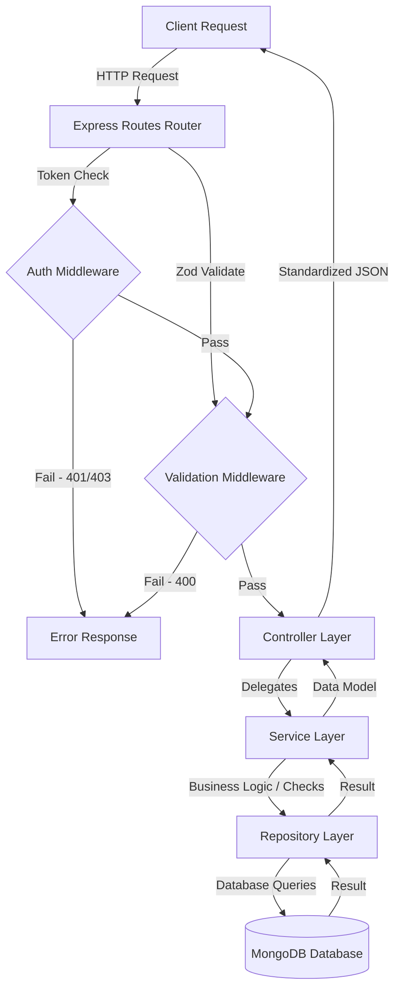
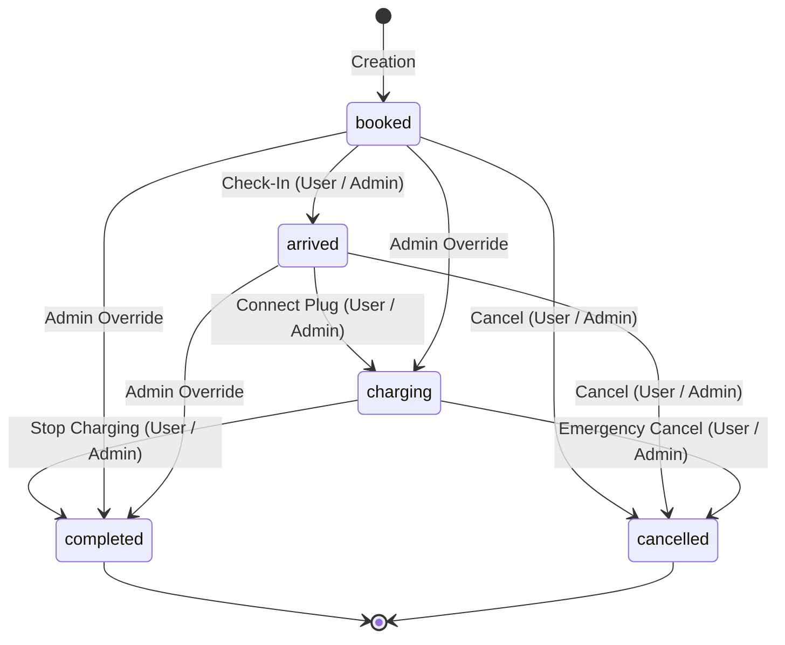

# ⚡ Evolts Backend API

> An enterprise-grade, high-performance RESTful API powering the Evolts Electric Vehicle (EV) Charging Station Locator and Slot Booking platform.

[](https://nodejs.org/)
[](https://expressjs.com/)
[](https://www.mongodb.com/)
[](https://jwt.io/)
[](https://zod.dev/)

---

## 🧠 Core Concepts Covered

This project demonstrates a production-ready EV charging management backend that implements:
- **Layered Service-Repository Architecture**: Ensures strict Separation of Concerns (SoC) by dividing logic into Routers, Controllers, Services, and Repositories.
- **Geospatial Location Queries**: Employs MongoDB `2dsphere` coordinates index and spatial query operators (e.g., `$near`, `$geometry`, `$maxDistance`) to locate nearby charging stations efficiently.
- **Robust Request Validation**: Implements middleware utilizing Zod schemas for sanitizing and type-checking incoming payloads (Body, Query, Params).
- **Role-Based Access Control (RBAC)**: Restricts administration privileges using authentication middlewares verifying JWT signatures and user role claims (`user` vs `admin`).
- **State Machine Workflow Management**: Tracks booking reservation Lifecycles with strict role-based state transition maps.
- **Database Query & Pagination Optimization**: Leverages Mongoose aggregation pipelines (`$match`, `$facet`, `$skip`, `$limit`) to handle paginated queries efficiently.
- **Conflict Avoidance Logic**: Prevents double-booking by calculating chronological time slot overlaps.

---

## 📖 Table of Contents
* [Core Concepts Covered](#-core-concepts-covered)
* [Architecture Overview](#-architecture-overview)
* [Core Features & Packages](#-core-features--packages)
* [Directory Structure](#-directory-structure)
* [Database Model Schemas](#-database-model-schemas)
  * [User Schema](#user-schema)
  * [Station Schema](#station-schema)
  * [Booking Schema](#booking-schema)
* [Business Rules & Logic](#-business-rules--logic)
  * [Booking Integrity Rules](#booking-integrity-rules)
  * [State Machine Transitions](#state-machine-transitions)
* [API Reference](#-api-reference)
  * [Authentication Endpoints (`/auth`)](#authentication-endpoints-auth)
  * [Station Endpoints (`/station`)](#station-endpoints-station)
  * [Booking Endpoints (`/booking`)](#booking-endpoints-booking)
* [Getting Started](#-getting-started)
  * [Prerequisites](#prerequisites)
  * [Environment Configuration](#environment-configuration)
  * [Installation & Execution](#installation--execution)

---

## 🏗️ Architecture Overview

The Evolts API is designed using the **Layered Service-Repository Pattern**, enforcing clean separation of concerns, high testability, and scalability.



---

## 🌟 Core Features & Packages

- [x] **Secure Authentication & RBAC**: Session management and signatures powered by `jsonwebtoken` (JWT) alongside secure salted hashing using `bcryptjs`.
- [x] **Geospatial Location Indexing**: Leverages `mongoose` schemas with `2dsphere` spatial coordinates indexing to calculate proximity using MongoDB geolocation operators.
- [x] **Strict Payload Validation**: Validates, parses, and coerces incoming request schemas (body, query, params) using `zod` declarative schema validation.
- [x] **Real-time Slot Calculations**: Pure JavaScript date-time range logic integrated with `mongoose` queries to locate vacant hourly slots.
- [x] **Role-Based State Machine**: State transition management utilizing `lodash` helper functions (`_.pick` and `_.omit`) for request filtering and data isolation.
- [x] **Environment Configuration**: Safe storage of credentials, DB connection strings, and keys using `dotenv`.
- [x] **Development Flow**: Hot-reloading development cycle powered by `nodemon`.

---

## 📂 Directory Structure

```text
backend/
├── src/
│   ├── config/
│   │   └── db.js                 # Database connection driver (Mongoose)
│   ├── middlewares/
│   │   ├── auth.middleware.js    # Authentication and role verification filters
│   │   └── validate.js           # Generic Zod parsing middleware for req body/query/params
│   ├── module/                   # Domain Modules
│   │   ├── auth/                 # User credentials & tokens module
│   │   ├── bookings/             # Booking slots management module
│   │   ├── stations/             # Charging hubs & pricing module
│   │   └── users/                # User profile and registered vehicle models
│   └── utils/
│       ├── createError.js        # Normalized error generation utility
│       ├── helpers.js            # General utility helpers & transition check maps
│       └── response.js           # Express response standardization helpers
├── index.js                      # Application main entry point
└── package.json                  # Dependencies, scripts and metadata
```

---

## 🗄️ Database Model Schemas

### User Schema
| Field | Type | Required / Index | Description |
| :--- | :--- | :---: | :--- |
| `username` | `String` | Yes | Name of the user |
| `phoneNumber`| `String` | Yes | 10-digit primary phone number |
| `email` | `String` | Yes (Unique) | Electronic mail address (lowercased) |
| `password` | `String` | Yes | Hashed password string |
| `role` | `String` | Yes | `"user"` or `"admin"`. Defaults to `"user"` |
| `vehicles` | `Array` | No | Nested subdocuments representing registered vehicles |

### Station Schema
| Field | Type | Required / Index | Description |
| :--- | :--- | :---: | :--- |
| `name` | `String` | Yes (Text Index) | Charging hub name (lowercased) |
| `address` | `String` | Yes | Detailed physical address location |
| `location` | `Object` | Yes (`2dsphere`) | GeoJSON Point with `coordinates: [longitude, latitude]` |
| `status` | `String` | Yes | `"online"` or `"offline"`. Defaults to `"online"` |
| `pricing` | `Number` | Yes | Hourly charging price |
| `chargerTypes`| `Object` | Yes | Subdocument with `charger` type (`slow`/`fast`/`superFast`) and `powerOut` |

### Booking Schema
| Field | Type | Required / Index | Description |
| :--- | :--- | :---: | :--- |
| `userId` | `ObjectId` | Yes (Ref: User) | Associated booking customer |
| `stationId` | `ObjectId` | Yes (Ref: Station) | Associated charging hub |
| `startTime` | `Date` | Yes | Charging reservation start ISO Date-time |
| `endTime` | `Date` | Yes | Charging reservation end ISO Date-time |
| `price` | `Number` | Yes | Booking reservation price paid |
| `bookingDate`| `Date` | Yes | Date when the booking transaction occurred |
| `status` | `String` | Yes | Status enum: `booked`, `arrived`, `charging`, `completed`, `cancelled` |

---

## ⚙️ Business Rules & Logic

### Booking Integrity Rules
To guarantee database integrity and prevent double-booking:
1. **Duration Restraint**: Charging slot reservations must be exactly **1 hour** (e.g. 14:00 to 15:00).
2. **Order Check**: `startTime` must precede `endTime`.
3. **Conflict Resolution**: Intersecting slots at the same station are rejected. The system checks:
   $$\text{Start}_{\text{existing}} < \text{End}_{\text{new}} \quad \text{AND} \quad \text{End}_{\text{existing}} > \text{Start}_{\text{new}}$$

### State Machine Transitions
Booking updates follow a strict lifecycle flow. Standard users have limited capabilities compared to administrators:



---

## 🔌 API Reference

### Authentication Endpoints (`/auth`)

#### Register a New User
* **Endpoint**: `POST /auth/register`
* **Access**: Public
* **Request Headers**: `Content-Type: application/json`

<details>
<summary><b>View Request Body Template</b></summary>

```json
{
  "username": "John Doe",
  "phoneNumber": "9876543210",
  "email": "john@example.com",
  "password": "secretPassword123",
  "role": "user",
  "vehicles": [
    {
      "vehicleNo": "MH12AB1234",
      "type": "4wheeler"
    }
  ]
}
```
</details>

<details>
<summary><b>View Success Response (201 Created)</b></summary>

```json
{
  "success": true,
  "message": "user created successfully",
  "data": {
    "user": {
      "_id": "648a123abc456def78901234",
      "username": "John Doe",
      "phoneNumber": "9876543210",
      "email": "john@example.com",
      "role": "user",
      "vehicles": [
        {
          "vehicleNo": "MH12AB1234",
          "type": "4wheeler",
          "_id": "648a123abc456def78901235"
        }
      ],
      "createdAt": "2026-06-09T08:00:00.000Z",
      "updatedAt": "2026-06-09T08:00:00.000Z"
    },
    "token": "eyJhbGciOiJIUzI1NiIsInR5cCI6IkpXVCJ9.eyJpZCI6IjY0OGExMjNhYmM0NTZkZWY3ODkwMTIzNCIsImVtYWlsIjoiam9obkBleGFtcGxlLmNvbSIsInJvbGUiOiJ1c2VyIiwiaWF0IjoxNzg2Njg4MDAwLCJleHAiOjE3ODcyOTI4MDB9..."
  }
}
```
</details>

#### Log In User
* **Endpoint**: `POST /auth/login`
* **Access**: Public
* **Request Headers**: `Content-Type: application/json`

<details>
<summary><b>View Request Body Template</b></summary>

```json
{
  "email": "john@example.com",
  "password": "secretPassword123"
}
```
</details>

<details>
<summary><b>View Success Response (200 OK)</b></summary>

```json
{
  "success": true,
  "message": "user loggedin successfully",
  "data": {
    "user": {
      "_id": "648a123abc456def78901234",
      "username": "John Doe",
      "email": "john@example.com",
      "role": "user"
    },
    "token": "eyJhbGciOiJIUzI1NiIsInR5cCI6IkpXVCJ9..."
  }
}
```
</details>

---

### Station Endpoints (`/station`)
*All requests require header: `Authorization: Bearer <JWT_TOKEN>`*

#### Create Charging Station
* **Endpoint**: `POST /station`
* **Access**: Admin Only
* **Request Headers**: `Content-Type: application/json`

<details>
<summary><b>View Request Body Template</b></summary>

```json
{
  "name": "Evolts Supercharge Hub",
  "address": "Baner Main Road, Pune",
  "location": {
    "type": "Point",
    "coordinates": [73.7934, 18.5596]
  },
  "status": "online",
  "pricing": 20,
  "chargerTypes": {
    "charger": "superFast",
    "powerOut": "180kW"
  }
}
```
</details>

<details>
<summary><b>View Success Response (201 Created)</b></summary>

```json
{
  "success": true,
  "message": "station created successfully",
  "data": {
    "_id": "648a5678ab123cde45678901",
    "name": "evolts supercharge hub",
    "address": "Baner Main Road, Pune",
    "location": {
      "type": "Point",
      "coordinates": [73.7934, 18.5596]
    },
    "status": "online",
    "pricing": 20,
    "chargerTypes": {
      "charger": "superFast",
      "powerOut": "180kW"
    }
  }
}
```
</details>

#### Search/Get Charging Stations
* **Endpoint**: `GET /station`
* **Access**: Authenticated Users / Admins
* **Query Parameters**:
  - `name` (String, Optional) - Prefix search (case-insensitive)
  - `status` (`online` | `offline`, Optional)
  - `chargeType` (`slow` | `fast` | `superFast`, Optional)
  - `minPrice` / `maxPrice` (Number, Optional)
  - `page` (Number, Optional, Default: `1`)
  - `limit` (Number, Optional, Default: `10`)

<details>
<summary><b>View Success Response (200 OK)</b></summary>

```json
{
  "success": true,
  "message": "All Available Stations",
  "data": {
    "page": 1,
    "totalItems": 1,
    "totalPages": 1,
    "stations": [
      {
        "_id": "648a5678ab123cde45678901",
        "name": "evolts supercharge hub",
        "address": "Baner Main Road, Pune",
        "location": {
          "type": "Point",
          "coordinates": [73.7934, 18.5596]
        },
        "status": "online",
        "pricing": 20,
        "chargerTypes": {
          "charger": "superFast",
          "powerOut": "180kW"
        }
      }
    ]
  }
}
```
</details>

#### Update Station Details
* **Endpoint**: `PUT /station/:stationId`
* **Access**: Admin Only
* **Request Headers**: `Content-Type: application/json`
* **URL Params**: `stationId` (MongoDB ObjectId)

<details>
<summary><b>View Success Response (200 OK)</b></summary>

```json
{
  "success": true,
  "message": "Station Updated Successfully",
  "data": {
    "_id": "648a5678ab123cde45678901",
    "name": "evolts supercharge hub",
    "status": "offline"
  }
}
```
</details>

#### Delete Charging Station
* **Endpoint**: `DELETE /station/:stationId`
* **Access**: Admin Only
* **URL Params**: `stationId` (MongoDB ObjectId)

<details>
<summary><b>View Success Response (200 OK)</b></summary>

```json
{
  "success": true,
  "message": "Station Deleted Successfully",
  "data": {
    "_id": "648a5678ab123cde45678901"
  }
}
```
</details>

---

### Booking Endpoints (`/booking`)
*All requests require header: `Authorization: Bearer <JWT_TOKEN>`*

#### Reserve a Slot
* **Endpoint**: `POST /booking`
* **Access**: Authenticated Users / Admins
* **Request Headers**: `Content-Type: application/json`

<details>
<summary><b>View Request Body Template</b></summary>

```json
{
  "stationId": "648a5678ab123cde45678901",
  "date": "2026-06-10",
  "startTime": "14:00",
  "endTime": "15:00",
  "price": 20,
  "status": "booked"
}
```
</details>

<details>
<summary><b>View Success Response (201 Created)</b></summary>

```json
{
  "success": true,
  "message": "Booking created Successfully",
  "data": {
    "_id": "648a9999ab123cde45678902",
    "userId": "648a123abc456def78901234",
    "stationId": "648a5678ab123cde45678901",
    "startTime": "2026-06-10T14:00:00.000Z",
    "endTime": "2026-06-10T15:00:00.000Z",
    "price": 20,
    "bookingDate": "2026-06-09T08:15:30.000Z",
    "status": "booked",
    "createdAt": "2026-06-09T08:15:30.000Z",
    "updatedAt": "2026-06-09T08:15:30.000Z"
  }
}
```
</details>

#### Check Available Slots for Date
* **Endpoint**: `GET /booking/slots`
* **Access**: Authenticated Users / Admins
* **Request Headers**: `Content-Type: application/json`

<details>
<summary><b>View Request Body Template</b></summary>

```json
{
  "stationId": "648a5678ab123cde45678901",
  "date": "2026-06-10"
}
```
</details>

<details>
<summary><b>View Success Response (200 OK)</b></summary>

```json
{
  "success": true,
  "message": "All Available Slots",
  "data": {
    "total": 23,
    "availableSlots": [
      { "startTime": "00:00", "endTime": "01:00" },
      { "startTime": "01:00", "endTime": "02:00" },
      { "startTime": "02:00", "endTime": "03:00" },
      { "startTime": "03:00", "endTime": "04:00" },
      { "startTime": "04:00", "endTime": "05:00" },
      { "startTime": "05:00", "endTime": "06:00" },
      { "startTime": "06:00", "endTime": "07:00" },
      { "startTime": "07:00", "endTime": "08:00" },
      { "startTime": "08:00", "endTime": "09:00" },
      { "startTime": "09:00", "endTime": "10:00" },
      { "startTime": "10:00", "endTime": "11:00" },
      { "startTime": "11:00", "endTime": "12:00" },
      { "startTime": "12:00", "endTime": "13:00" },
      { "startTime": "13:00", "endTime": "14:00" },
      { "startTime": "15:00", "endTime": "16:00" },
      { "startTime": "16:00", "endTime": "17:00" },
      { "startTime": "17:00", "endTime": "18:00" },
      { "startTime": "18:00", "endTime": "19:00" },
      { "startTime": "19:00", "endTime": "20:00" },
      { "startTime": "20:00", "endTime": "21:00" },
      { "startTime": "21:00", "endTime": "22:00" },
      { "startTime": "22:00", "endTime": "23:00" },
      { "startTime": "23:00", "endTime": "24:00" }
    ]
  }
}
```
*Notice that `14:00 - 15:00` is automatically omitted since it was booked in the previous step.*
</details>

#### Fetch All Bookings
* **Endpoint**: `GET /booking`
* **Access**: Authenticated Users / Admins
* **Query Parameters**:
  - `stationId` (String, Optional)
  - `userId` (String, Optional)
  - `status` (`booked` | `arrived` | `charging` | `completed` | `cancelled`, Optional)
  - `page` (Number, Default: `1`)
  - `limit` (Number, Default: `10`)
* **Behavior**: Admins receive all bookings matching the filters. Standard users are strictly hard-scoped to their own `userId` records.

#### Fetch Single Booking
* **Endpoint**: `GET /booking/:bookingId`
* **Access**: Owner User or Admin

#### Patch Booking Status
* **Endpoint**: `PATCH /booking/:bookingId`
* **Access**: Owner User or Admin
* **Query Parameters**:
  - `status` (Required, e.g. `?status=arrived`)
* **Transition Checks**: Enforces the State Machine rules before committing changes to MongoDB.

---

## 🚀 Getting Started

### Prerequisites
- Node.js (v18.0.0+)
- MongoDB Atlas account or local database instance

### Environment Configuration
Create an `.env` file in the project's root folder:
```env
PORT=5000
MONGO_URI=mongodb+srv://<username>:<password>@cluster.mongodb.net/evolts_db
JWT_SECRET=your_jwt_signature_secret_key_here
```

### Installation & Execution
1. Install dependencies:
   ```bash
   npm install
   ```
2. Run in Development Mode:
   ```bash
   npm run dev
   ```
3. Run in Production Mode:
   ```bash
   node index.js
   ```
   
---

*Developed by the Evolts Team.*
